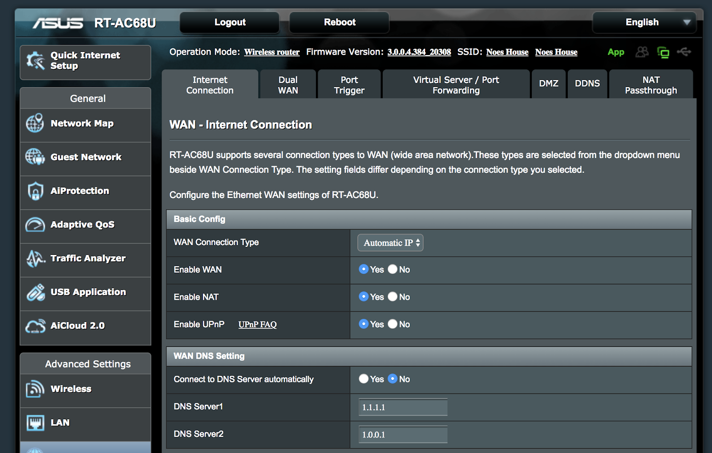

Follow this quick guide to start using 1.1.1.1 on your router.

Step 1: Go to the IP address used to access your router's admin console in your browser.

  * Linksys and Asus routers typically use [http://192.168.1.1](http://192.168.1.1)
  * Netgear routers typically use [http://192.168.0.1](http://192.168.0.1) or [http://192.168.1.1](http://192.168.1.1)
  * D-Link routers typically use [http://192.168.0.1](http://192.168.0.1)
  * Ubiquiti routers typically use [http://unifi.ubnt.com](http://unifi.ubnt.com)

Step 2: Enter the router password.

Step 3: Find the place in the admin console where DNS settings are set.

Step 4: Replace the existing addresses with:

    1.1.1.1
    1.0.0.1
    2606:4700:4700::1111
    2606:4700:4700::1001

Step 5: Save and exit.

## Using DNS-Over-TLS on OpenWRT

It is possible to encrypt DNS traffic out from your router using DNS-over-TLS if it is running OpenWRT. For more details, see our blog post on the topic: [Adding DNS-Over-TLS support to OpenWRT (LEDE) with Unbound](https://blog.cloudflare.com/dns-over-tls-for-openwrt/)

## Ubiquiti UniFi Controller

<stream src="510f09dad9812cd7ac009ebcab75068e" site="cloudflare.com" controls></stream>

Step 1: Go to [http://unifi.ubnt.com](http://unifi.ubnt.com) and enter your email and password.

Step 2: Click on the name of the network you are managing. Click Launch.

Step 3: Click on the settings icon in the lower left-hand corner.

Step 4: From the settings menu, choose Networks.

Step 5; Click Edit by the name of the Network.

Step 6: Scroll to where it says DHCP Name Server. If Auto is selected, select Manual instead.

Step 7: In the boxes called DNS Server 1, 2, 3, etc. put:

    1.1.1.1
    1.0.0.1
    2606:4700:4700::1111
    2606:4700:4700::1001

Step 8: Click Save.

## Google Wi-Fi

Step 1: Open the Google Wifi app on your phone.

Step 2: Click the settings tab, then click on Network & general

Step 3: Click on Advanced networking then click on DNS

Step 4: Remove any IP addresses that may be already listed and in their place enter:

    1.1.1.1
    1.0.0.1
    2606:4700:4700::1111
    2606:4700:4700::1001

Step 5: Click Save.

## Asus Router

Step 1: Go to https://192.168.1.1/

Step 2: Under Advanced Settings, click on WAN

Step 3: In the Internet Connection tab, under WAN DNS Setting, in DNS servers, add:

    1.1.1.1
    1.0.0.1
    2606:4700:4700::1111
    2606:4700:4700::1001
