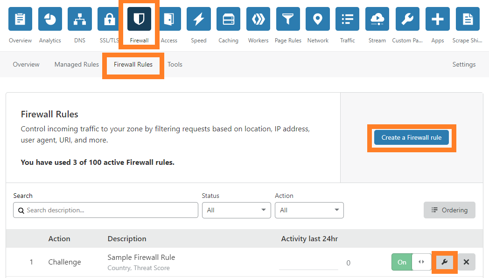
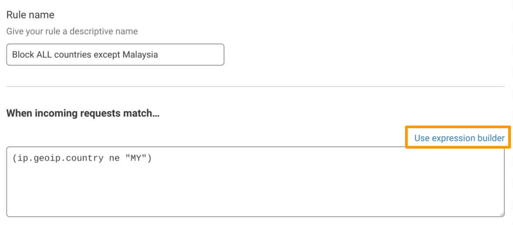

import {Notice} from 'cf-gatsby-theme'

### Overview

The **Expression Preview** editor is a text-only interface for creating Firewall Rules expressions. Although it lacks the visual simplicity of the Expression Builder, the Expression Preview editor supports the entire specification of Cloudflare's Firewall Rules Language.

For example, only the Expression Preview editor supports grouping symbols. Cloudflare designed the Firewall Rules Language with [Wireshark Display Filters®](https://www.wireshark.org/docs/wsug_html_chunked/ChWorkBuildDisplayFilterSection.html) in mind, so although there are some subtle differences, Wireshark users should feel right at home with Firewall Rules and be able to easily port their existing rules to Cloudflare.

<Notice>

Firewall Rules expressions have a 4KB limit. This is approximately 4,000 text characters. This limit applies whether you use the visual **Expression Builder** or edit your expression manually in the **Expression Preview** text box.
</Notice>

---

### Use the Expression Preview editor

The Expression Preview editor is located in the **Create Firewall Rule** and **Edit Firewall Rule** panels. The editor supports all available Firewall Rules fields, operators, and transformation functions. It also supports parentheses as grouping symbols.

To edit an expression in the editor:

1. In the **Firewall Rules** tab, use the **Create a Firewall rule** button to create a new rule or the **Edit** button (wrench icon) to edit an existing rule.

   

1. Click the **Edit expression** link above the Expression Preview to switch to the Expression Preview editor.

   

1. From the Expression Preview editor, click the **Use expression builder** link to switch back to the Expression Builder:

   

In general you can switch back and forth between the Expression Builder and the Expression Preview editor. However, if you use parentheses to nest expressions in the editor, you will not be able to switch to the Expression Builder, because the builder does not support nested expressions.

---

### Create nested expressions

A key advantage of the Expression Preview editor is support for parentheses as grouping symbols, which allow you to explicitly group and nest expressions and, in turn, create highly targeted expressions.

The following example illustrates a rule that challenges any visitor who is not from Malaysia and tries to access WordPress URI paths.

Only the Expression Preview editor supports nested expressions such as the one above. If you create a rule with nested expressions in the Expression Preview editor and try to switch to the Expression Builder, a dialog will warn you that the expression is not supported in the builder. You will be prompted to **Discard changes** and switch to the Expression Builder or **Cancel** and continue working in the editor.

Cloudflare validates all expressions before saving them, so if your expression is malformed, you will receive an error message, as shown at the bottom of this screenshot:

The Expression Preview editor supports the entire Firewall Rules Language. For a complete listing of supported fields and operators, as well as guidance on using grouping symbols, see _[Firewall Rules language](/firewall/cf-firewall-language/)_.
