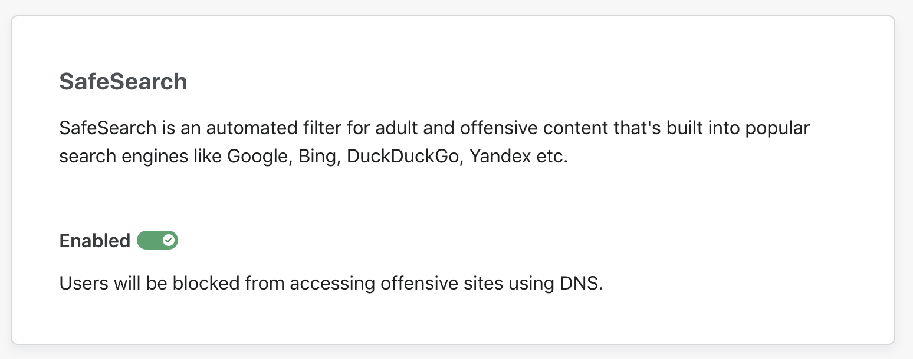
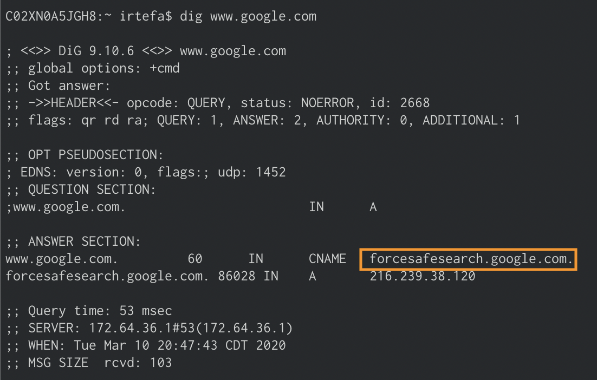
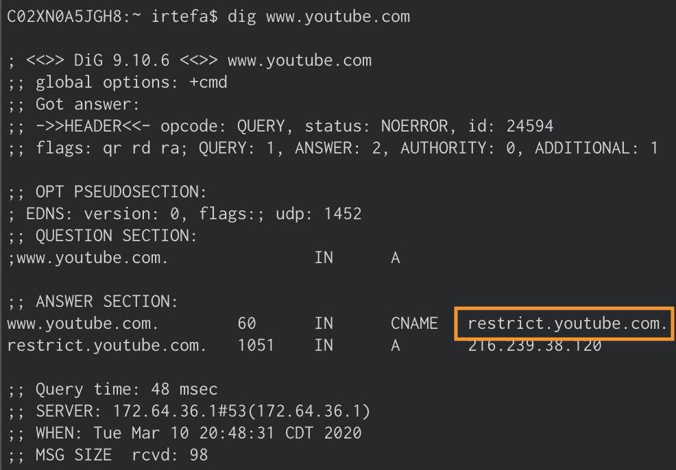
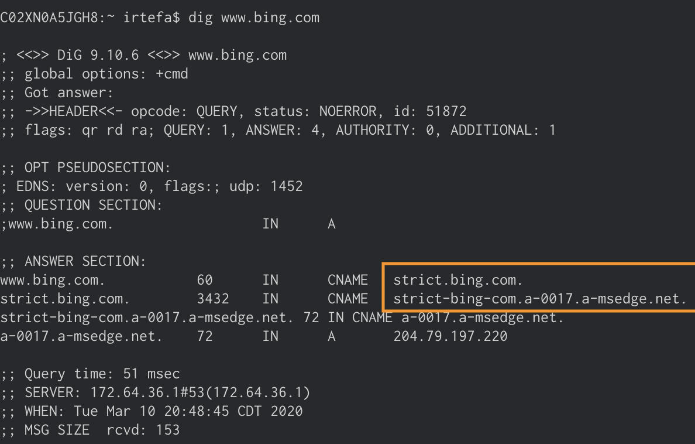
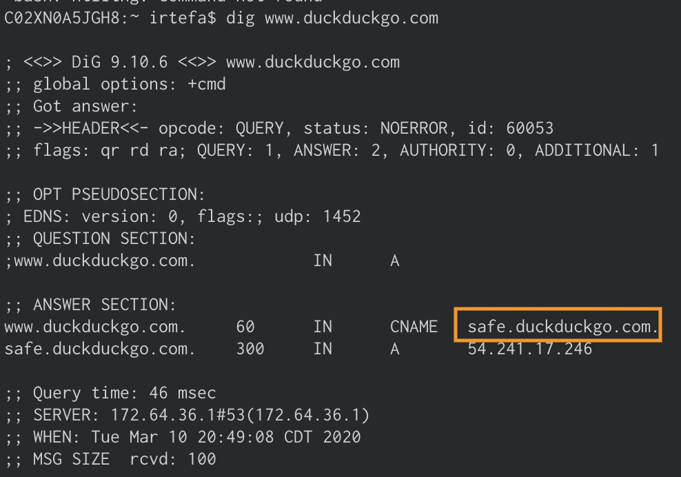

SafeSearch is a feature of search engines that can help you filter explicit or offensive content. When you enable SafeSearch, the search engine filters explicit or offensive content and returns search results that are safe for children, you or at work.

You can use Cloudflare Gateway to enable SafeSearch on search engines like Google, Bing, Yandex, YouTube and DuckDuckGo.

To enable SafeSearch for Cloudflare Gateway, follow the steps below:

1. Navigate to the **Policies** tab. If you don't have a policy, create one following [these instructions](/gateway/getting-started-new/configuring-policies).

2. Navigate to the **Overview** tab.

3. Scroll down to see the **SafeSearch** card.

4. Enable the switch inside the **SafeSearch** card.

5. Hit **Save**.

## Test SafeSearch
You can test if SafeSearch is working by performing dig on the search engines. Instead of returning the regular IP address, you should see the CNAMEs returned like below:

### Google
Google will return `forcesafesearch.google.com`.

### YouTube
YouTube will return `restrict.youtube.com`.

### Bing
Bing will return `strict.bing.com`.

### DuckDuckGo
DuckDuckGo will return `safe.duckduckgo.com`.

