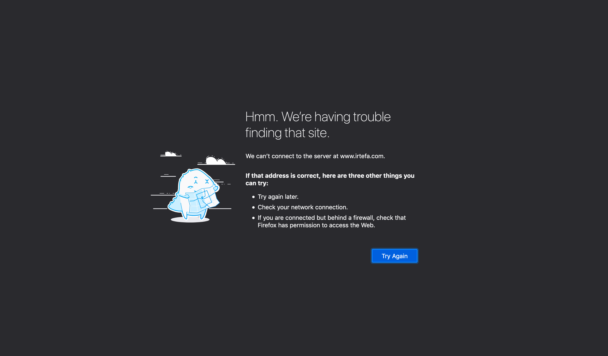
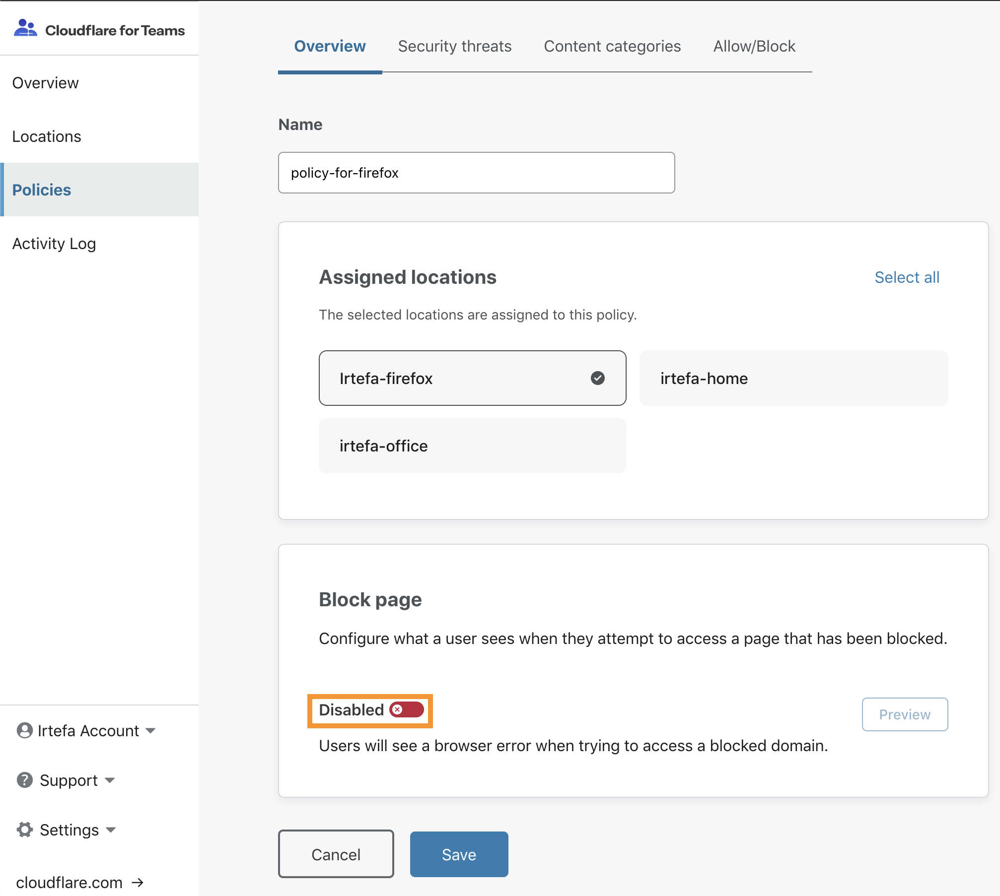
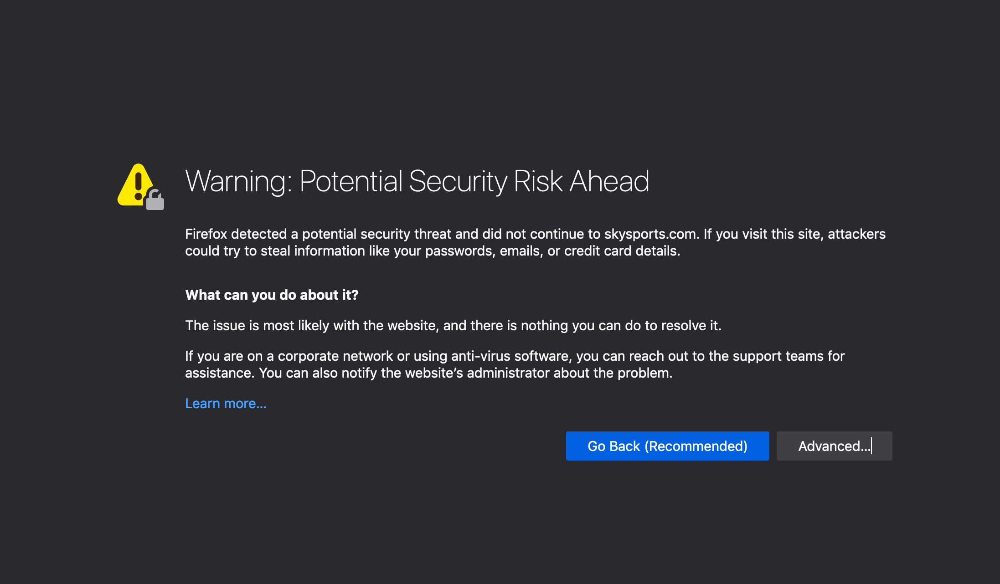
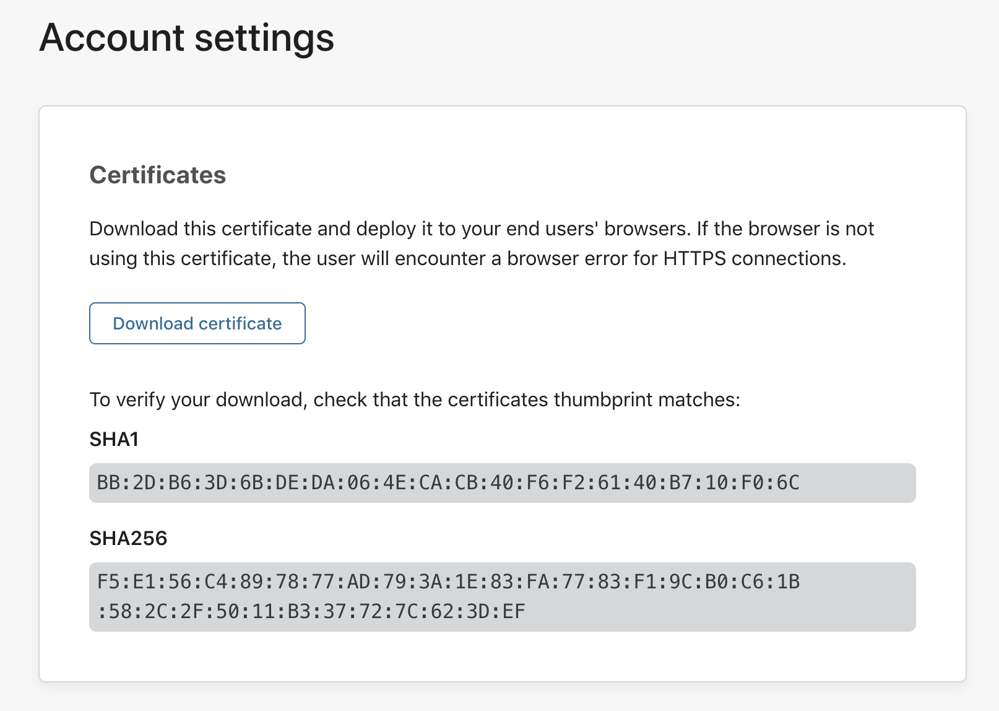
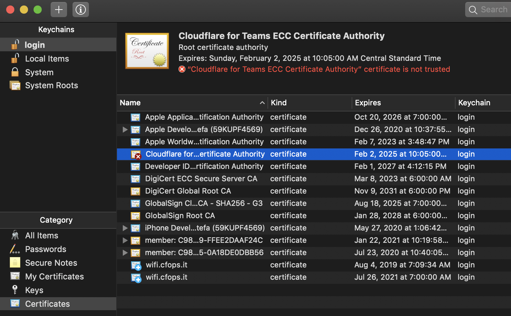
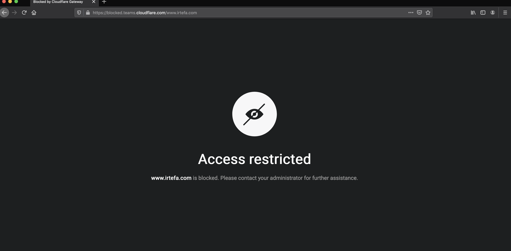

- [Enable a block page](#enable-a-block-page)
- [Download certificate](#download-certificate)
- [Add certificate to your system](#add-certificate-to-your-system)
- [Update preferences if you are using Firefox](#firefox)
- [See block page](#see-block-page)

When you try to visit a blocked website, by default you will see a browser error like the page you see below:

You will see this page because Gateway is not returning the IP address for the blocked domain. As a result, your browser cannot take you to that website. 

However, this may be confusing for some people as they may think that their Internet is not working. 

You can remove this confusion by show Cloudflare Gateway's block page to explain to the end user why a website is blocked.

Here's how you can configure a block page using Gateway's policy engine:

## Enable block page

In the policy configuration page, enable the block by toggling the switch annotated above. Hit 'Save'.

Enabling block page alone will not work for HTTPS connections. Your users will see the following error now when they try to visit a blocked website:

## Download certificate
To fix the browser error, go to the Account page to download a certificate given by Cloudflare.

From the account page click on 'Download' to add the certificate:

## Add certificate to your system
You will need to add the certificate to your system to ensure your web browser will use this certificate to establish HTTPS connections.

If you are on a Mac, double click on the .pem file. You will notice that the certificate is now listed in the 'Keychain Access' application like below:

Double click on the certificate and then click on 'Trust'

From the drop down menu for **When using this certificate** select ***Always Trust*** like below:

Now close the menu and if your system asks for admin permission enter your password or use your fingerprint ID to confirm the changes.

## Firefox
If you are not using Firefox, you can skip to the next section. 

Follow the instructions below to finish configuring the block page:

* Enter **about:config** in the address bar

* Click on **Accept the risk!** if you see a prompt from Firefox.

* Set `security.enterprise_roots.enabled` to `true`

## See block page
You are now all set, and when you visit a blocked website you will see the following block page:

