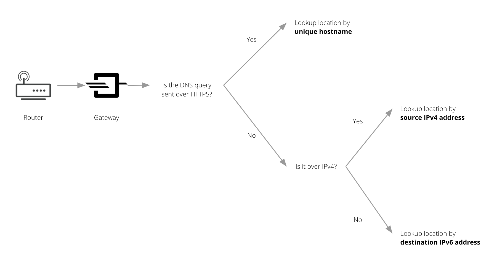

## What is a Location? 

Locations are physical entities like offices, homes, retail stores, movie theaters or data centers. The fastest way to start sending DNS queries from a location and protect it from security threats is by changing the DNS resolvers at the router to the dedicated IPv6 addresses for those locations.

If you don’t have IPv6 network, you can set up a location by adding the source IP for the location and changing the DNS resolvers to 

* **172.64.36.1**
* **172.64.36.2**

If you want to send your DNS queries over an encrypted connection, you can use the hostname that we provide in the dashboard to send queries using DNS over HTTPS. Head to the [Getting started](/gateway/getting-started-new/) to learn more on how to setup a location.

## How does Gateway determine the location of a DNS query?

Gateway uses different ways to match a DNS query to locations depending on the type of request and network. This is how Gateway determines the location of a DNS query:

Here is a step by step flow of how Gateway determines the location for an incoming DNS query:

#### Step 1: DNS over HTTPS check and lookup based on hostname
Check if the DNS query is using DNS over HTTPS. If yes, lookup location by the unique hostname. If not, go to step 2.

#### Step 2: IPv4 check and lookup based on source IPv4 address
Check if the DNS query is sent over IPv4. If yes, lookup location by the source IPv4 address. If no, go to step 3.

#### Step 3: Lookup based on IPv6
If the query is in this step, it means that the DNS query is using IPv6. Gateway will lookup the location associated with the DNS query based on the destination IPv6 address.

## IPv4
Gateway uses the public source IPv4 address of your network to identify your location, apply policies and log the DNS requests. When you go through onboarding, or in our location tab, the dashboard automatically identifies the public source IP address.

If you are using Cloudflare Gateway as part of a paid plan, you can manually enter the IP address and netmask of your location. The IP address for the location from which you are interfacing with the Teams dashboard will populate the IP address field. Use this as a quick reference for the location or type in the public IP address and CIDR notation for the new location.  

On your router or if you are using a device or a daemon, forward DNS queries to the following IP addresses:

* **172.64.36.1**
* **172.64.36.2**

See how you can start sending DNS queries by visiting the [Getting started](/gateway/getting-started-new/) section.

## IPv6
When you create a location, your location will receive a unique IPv6 address. Cloudflare Gateway will identify your location based on this unique IPv6 address. 

On your router/device/forwarder/daemon forward DNS queries to the corresponding IPv6 address for the location.

See how you can start sending DNS queries by visiting the [Getting started](/gateway/getting-started-new/) section.