This tutorial explains how to analyze [Cloudflare Logs](https://www.cloudflare.com/products/cloudflare-logs/) using the [Cloudflare App for Splunk](https://splunkbase.splunk.com/app/4501/).

- [Overview](#overview)
  - [Prerequisites](#prerequisites)
- [Task 1 - Connect AWS S3 to Splunk](#task1)
- [Task 2 - Install and Configure the Cloudflare App for Splunk](#task2)
- [Task 3 - View the Dashboards](#task3)
  - [About the Dashboards](#about-the-dashboards)
  - [Filters](#filters)
- [Debugging tips](#debugging-tips)
  - [Incomplete dashboards](#incomplete-dashboards)

---

<a id="overview" style="color: inherit">

### Overview
</a>

If you haven’t used Cloudflare Logs before, visit our [logs documentation](/logs/about/) for more details. Contact your Cloudflare Customer Account Team to enable logs for your account.

This tutorial describes how to get Cloudflare logs from Amazon S3 into Splunk using the [Splunk Add-on for Amazon Web Services](https://splunkbase.splunk.com/app/1876/). To learn how to use Logpush to send logs to AWS S3, refer to the [Logpush documentation](/logs/logpush/). Alternatively, you can use [Logpull](/logs/logpull-api/) to get logs to your [Splunk HTTP Event Collector](http://dev.splunk.com/view/event-collector/SP-CAAAE6M) directly and skip Task 1.

<a id="prerequisites" style="color: inherit">

#### Prerequisites
</a>

Before sending your Cloudflare log data to Splunk, make sure that you:

- Have an existing Splunk Enterprise or Cloud account
- Have a Cloudflare Enterprise account with Cloudflare Logs enabled
- Configure [Logpush](/logs/logpush/) or [Logpull](/logs/logpull-api/)
- Consult the [Splunk documentation](https://splunkbase.splunk.com/app/4501/) for the Cloudflare App

<Aside type="note">

Cloudflare logs are HTTP/HTTPS request logs in JSON format and are gathered from our 194+ data centers globally. By default, timestamps are returned as Unix nanosecond integers. We recommend using the RFC 3339 format for sending logs to Splunk.
</Aside>

---

<a id="task1" style="color: inherit">

### Task 1 - Connect AWS S3 to Splunk
</a>

Before completing this task, make sure you’ve enabled [Cloudflare Logpush on AWS S3](/logs/logpush/aws-s3/).

To start receiving Cloudflare log data, you need to connect AWS S3 to Splunk as follows:

1. Log in to your Splunk instance > **Apps** > **Find More Apps.**

2. Search for **Splunk Add-on for Amazon Web Services.**

3. Use your Splunk account login credentials to download and install the application.
   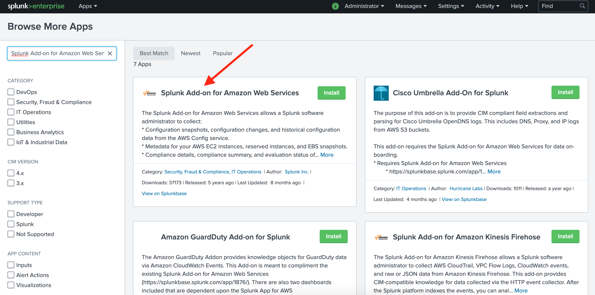

4. Once installed, restart and reopen your Splunk instance.

5. Next, click **Configuration** and enter your **AWS account Key ID** and **Secret Key**. We recommend creating a separate AWS user account with an **AmazonS3ReadOnlyAccess** policy.
   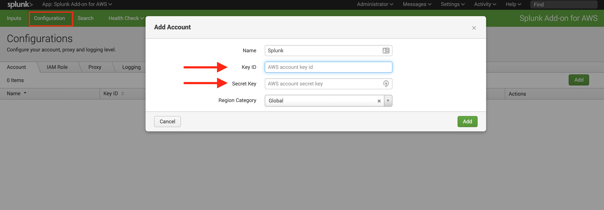

6. In **Configurations**, click **Create New Input** > **S3 Access Logs** > **Generic S3**, and enter the following:

   - **Name:** _cloudflare-logs-s3_

   - **AWS Account:** Enter the read-only AWS account you created for the Splunk instance.

   - **Assume role:** Optional

   - **S3 bucket:** From the drop down menu, select the S3 bucket containing the Cloudflare logs.

   - **S3 Key Prefix:** Leave empty.

   - **Source Type:** Enter \_cloudflare:json_or if disabled, see Step 7 below.

   - **Index:** Enter \_cloudflare.\_You can use an existing index or create a new one as described in Step 8 below.

   - **Advanced Settings** > **Polling Interval:** Enter _300._
     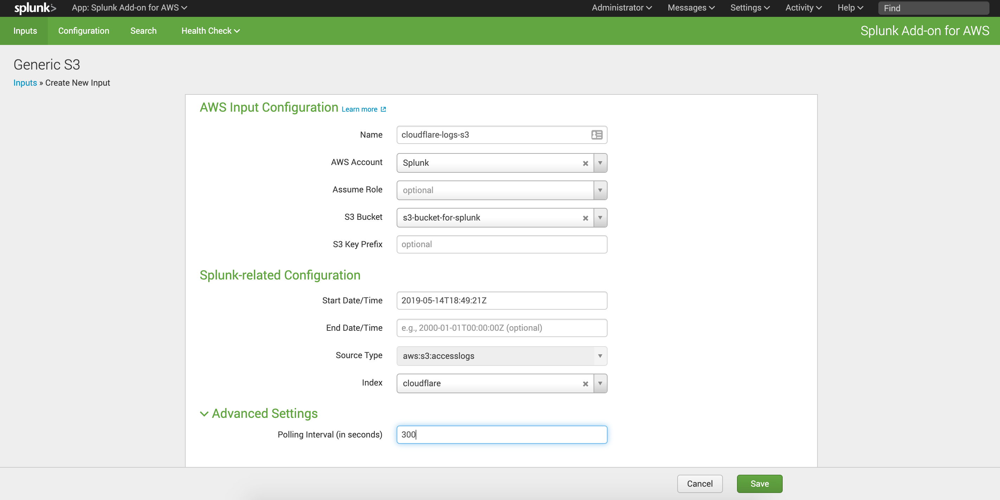

7. If the field is inactive and you can’t update the default value _aws:s3:accesslogs,\_as shown in the screenshot above_,\_update the **Source Type** manually by going to **Settings** > **Data Inputs** > Select **AWS S3** and open your current AWS S3 connection.
   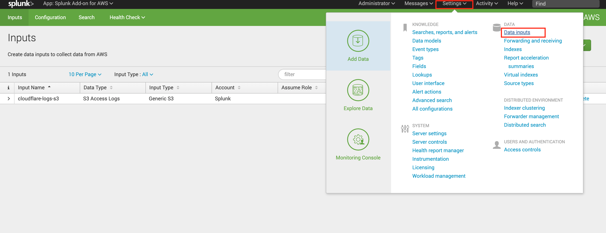
   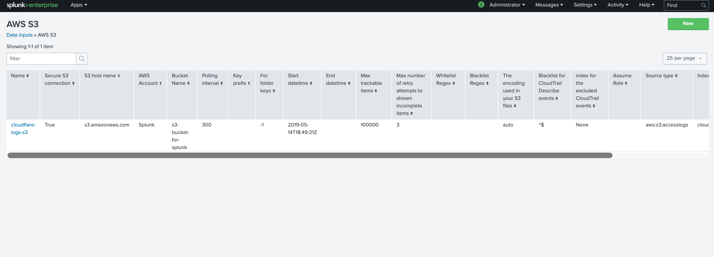
   Scroll down and select **More Settings**. Manually update field **Source type** to the value \_cloudflare:json_and click **Save**.
   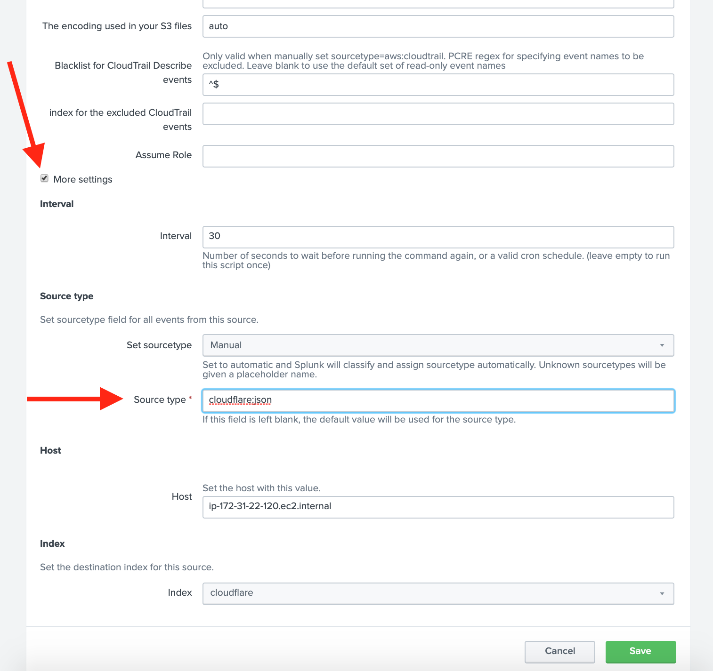

8. To create a new index go to **Settings** > **Indexes** > **New Index**, then enter \_cloudflare_as the **Index Name** and leave the default settings or update them according to your preferences. Then, click **Save**.
   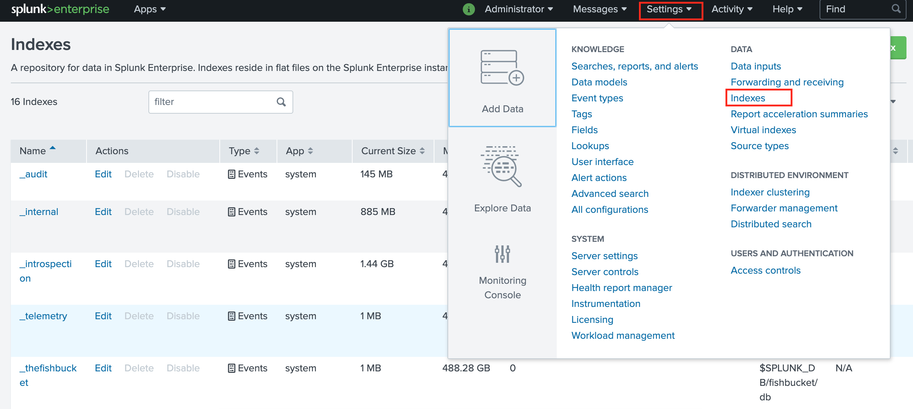
   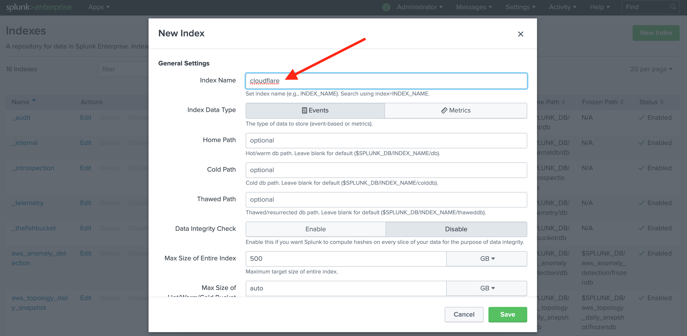

Now, logs should be loading into Splunk. You can verify this under **Splunk Add-on for AWS** > **Search**. In the search box, type:

`index=* sourcetype=cloudflare:json`

Next, select the desired time interval and and click **Search**.

If everything is configured correctly, you should be able to see Cloudflare logs as shown in the screenshot below.

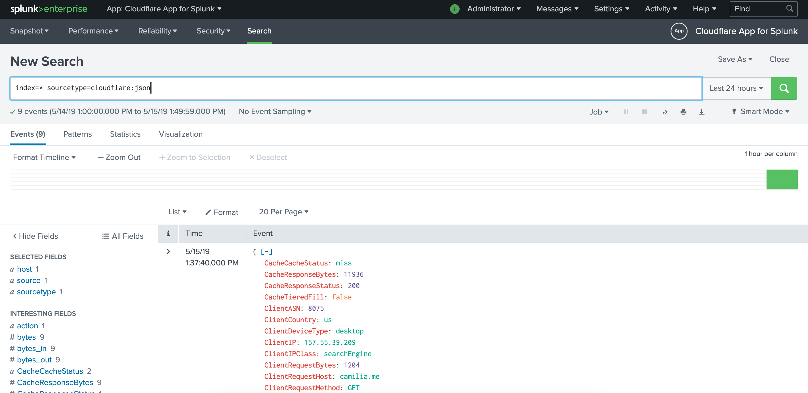

---

<a id="task2" style="color: inherit">

### Task 2 - Install and Configure the Cloudflare App for Splunk
</a>
To install the [Cloudflare App for Splunk](https://splunkbase.splunk.com/app/4501/):

1. Login to your Splunk instance.
2. Under **Apps** > **Find More Apps** search for _Cloudflare App for Splunk._
3. Click **Install**.

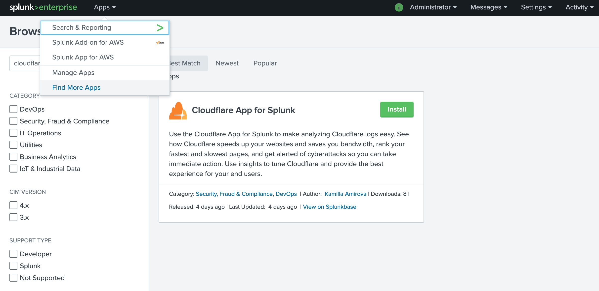

Once installed, you need to configure the application. To do this, a set up page is included with the application:

1. Open the set up screen by clicking the **Apps** dropdown, then **Manage Apps** > **Cloudflare Set Up.**
2. Enter the **Index name** where the Cloudflare JSON logs are stored. This value must be entered in the format _index=index_name_. By default the value is set to _index=cloudflare_.
3. Optional: Enable [Data Model Acceleration](https://docs.splunk.com/Documentation/Splunk/7.2.6/Knowledge/Acceleratedatamodels). This option is disabled by default.

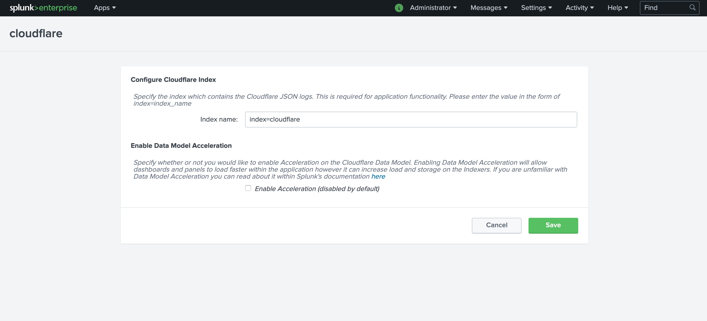

The Cloudflare App is now installed and the dashboards should be populating with data.

<Aside type="note">

Some reports contain calculated fields. If you wish to check how values were calculated or to adjust formulas, click **Settings** > **Data Models** > **Cloudflare**. Here, you can view and edit all the available fields.
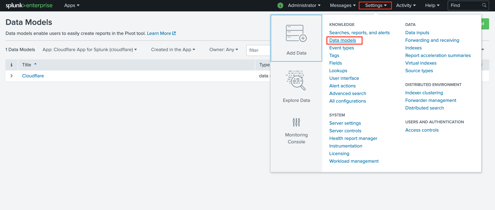
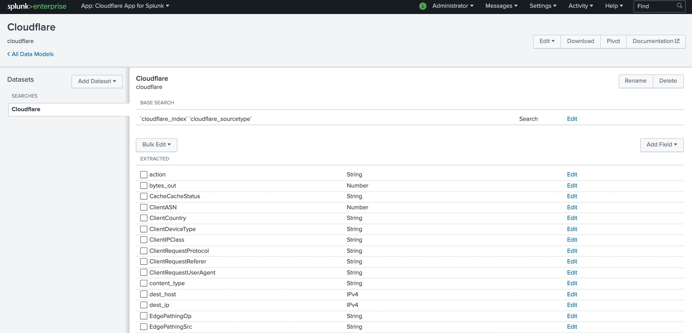
</Aside>

**Post Installation Notes**

You can change the **Index Name** after initial configuration by accessing the app **Set up** page by clicking on the **Apps** dropdown, then **Manage Apps** > **Cloudflare App for Splunk** > **Set up**.

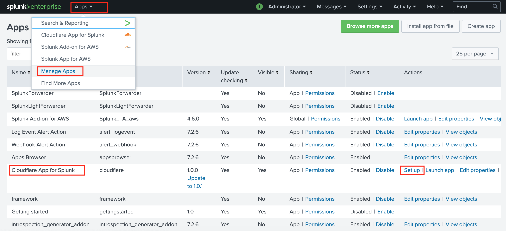

Also, you can find the Index Name manually by visiting **Settings** > **Advanced search** > **Search macros**.

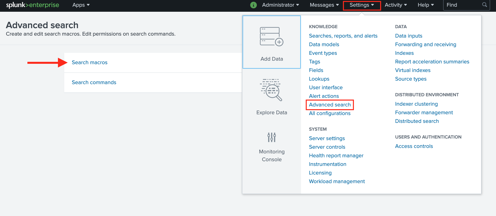

The Cloudflare App for Splunk comes with a custom Cloudflare Data Model which has an acceleration time frame of 1 day but is not accelerated by default. If you enable [Data Model acceleration](https://docs.splunk.com/Documentation/Splunk/7.2.6/Knowledge/Acceleratedatamodels), we recommend that the Data Model is only accelerated for 1 or 7 days to ensure there are no adverse effects within your Splunk environment.

You can enable or disable acceleration after the initial configuration by accessing the app Set up page by clicking the **Apps** dropdown, then **Manage Apps** > **Cloudflare Set Up**.

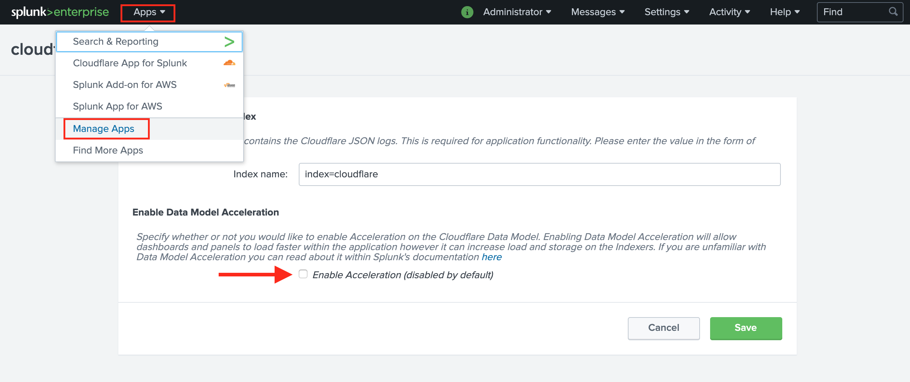

You can also manually configure Data Models by going to **Settings** > **Data models**. Learn more about data model acceleration [here](https://docs.splunk.com/Documentation/Splunk/latest/Knowledge/Acceleratedatamodels).

---

<a id="task3" style="color: inherit">

#### Task 3 - View the Dashboards
</a>

You can analyze Cloudflare logs with the thirteen (13) dashboards listed below.

You can use filters within these dashboards to help narrow the analysis by date and time, device type, country, user agent, client IP, hostname, and more to further help with debugging and tracing.

<a id="about-the-dashboards" style="color: inherit">

#### About the Dashboards
</a>

The following dashboards outlined below are available as part of the Cloudflare App for Splunk.

##### Cloudflare - Snapshot

_Web Traffic Overview_ and _Web Traffic Types_: Get an overview of the most important metrics from your websites and applications on the Cloudflare network.
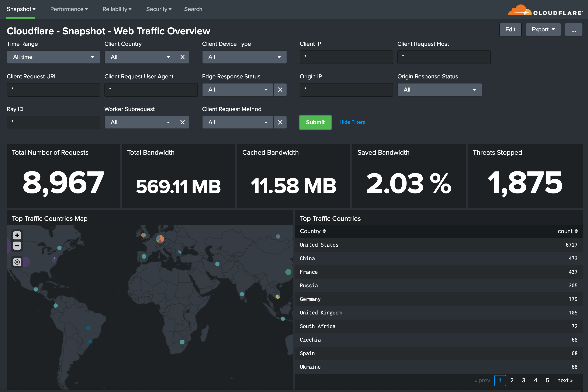

##### Cloudflare - Reliability

_Summary_ and _Detailed_: Get insights on the availability of your websites and applications. Metrics include origin response error ratio, origin response status over time, percentage of 3xx/4xx/5xx errors over time, and more.
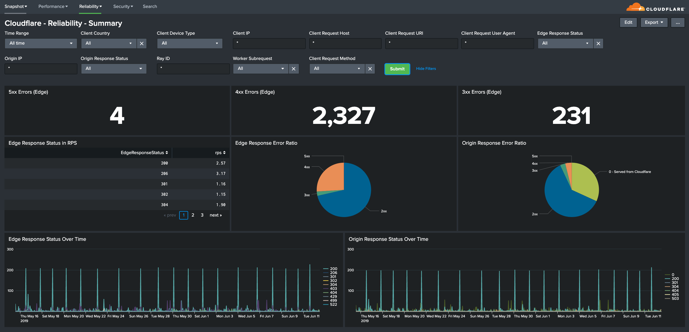

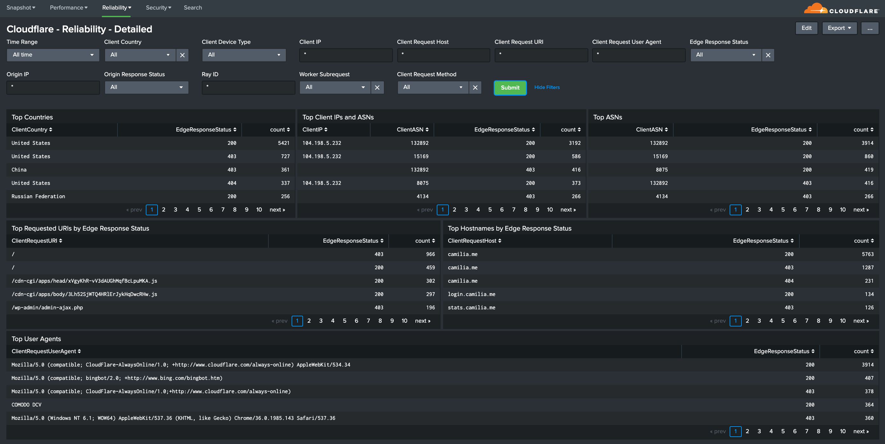

##### Cloudflare - Security

_Overview_: Get insights on threats to your websites and applications, including number of threats stopped, threats over time, top threat countries, and more.
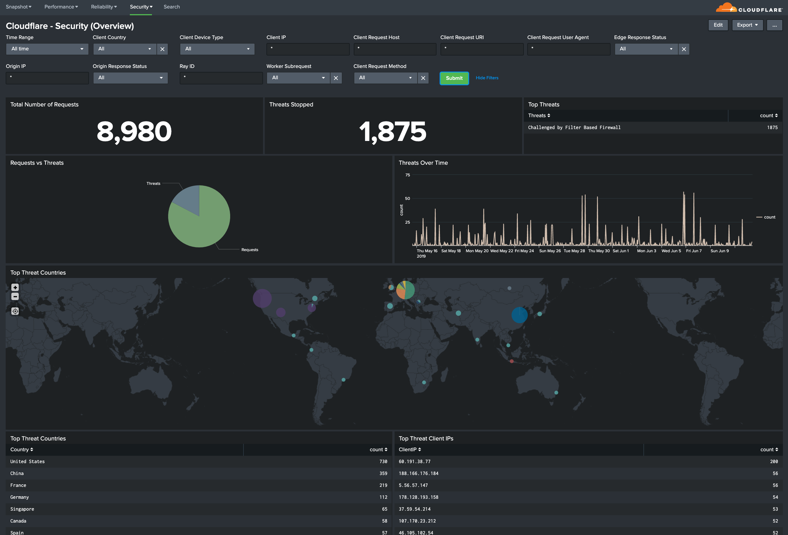

_WAF_: Get insights on threat identification and mitigation by our Web Application Firewall, including events like SQL injections, XSS, and more. Use this data to fine tune the firewall to target obvious threats and prevent false positives.

_Rate Limiting_: Get insights on rate limiting protection against denial-of-service attacks, brute-force login attempts, and other types of abusive behavior targeted at your websites or applications.

_Bots Summary_ and _Bots Detailed_: Investigate bot activity on your website to prevent content scraping, checkout fraud, spam registration and other malicious activities.
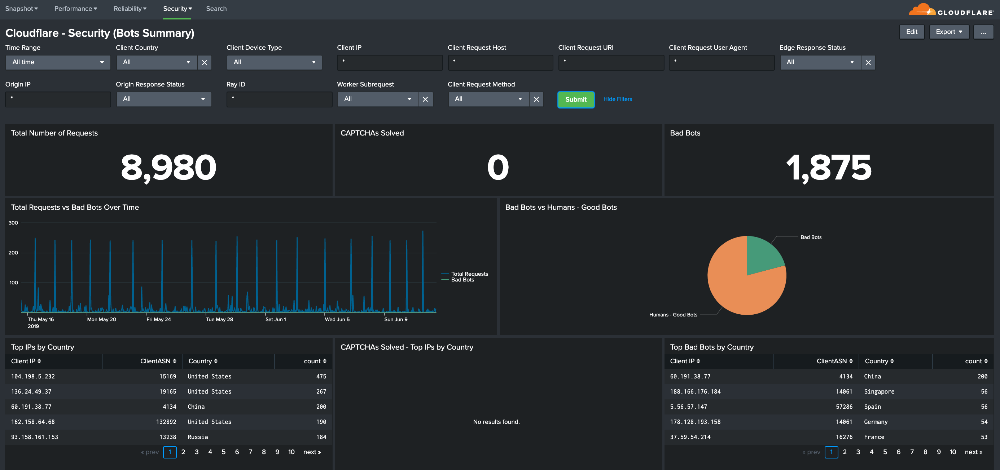

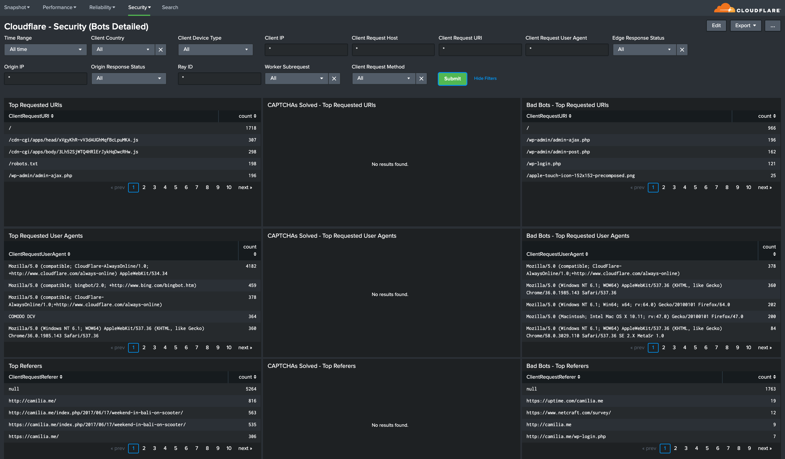

##### Cloudflare - Performance

_Requests and Cache_ and _Bandwidth_: Identify and address performance issues and caching misconfigurations. Metrics include total vs. cached bandwidth, saved bandwidth, total requests, cache ratio, top uncached requests, and more.

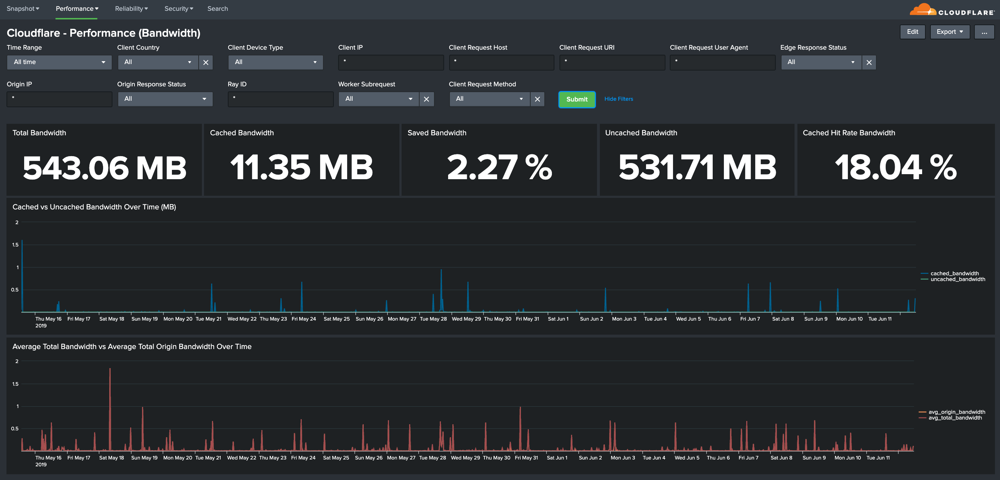

_Hostname, Content Type, Request Methods, Connection Type_: Get insights into your most popular hostnames, most requested content types, breakdown of request methods, and connection type.

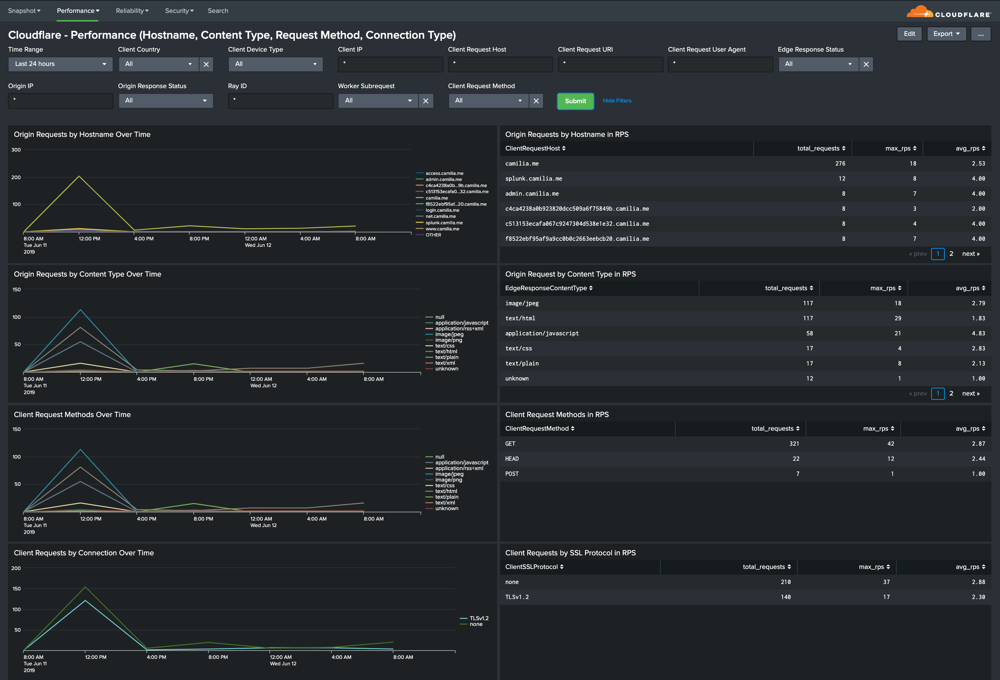

_Static vs. Dynamic Content_: Get insights into the performance of your static and dynamic content, including slowest URLs.

<a id="filters" style="color: inherit">

#### Filters
</a>

All dashboard have a set of filters that you can apply to the entire dashboard, as shown in the following example. Filters are applied across the entire dashboard.

You can use filters to drill down and examine the data at a granular level. Filters include client country, client device type, client IP, client request host, client request URI, client request user agent, edge response status, origin IP, and origin response status.

The default time interval is set to 24 hours. Note that for correct calculations filter will need to exclude Worker subrequests (**WorkerSubrequest** = _false_) and purge requests (**ClientRequestMethod** is not _PURGE_).

Available Filters:

- Time Range (EdgeStartTimestamp)

- Client Country

- Client Device type

- Client IP

- Client Request Host

- Client Request URI

- Client Request User Agent

- Edge response status

- Origin IP

- Origin Response Status

- RayID

- Worker Subrequest

- Client Request Method

---

<a id="debugging-tips" style="color: inherit">

### Debugging tips
</a>

<a id="incomplete-dashboards" style="color: inherit">

#### Incomplete dashboards
</a>

The Splunk Cloudflare App relies on data from the Cloudflare Enterprise Logs fields outlined below. Depending on which fields you have enabled, certain dashboards might not populate fully.

If that is the case, verify and test the Cloudflare App filters below each dashboard (these filters are the same across all dashboards). You can delete any filters that you don’t need, even if such filters include data fields already contained in your logs.

Also, you could compare the list of fields you are getting in Cloudflare Logs with the fields listed in **Splunk** > **Settings** > **Data Model** > **Cloudflare**.

The available fields are:

- CacheCacheStatus

- CacheResponseBytes

- CacheResponseStatus

- ClientASN

- ClientCountry

- ClientDeviceType

- ClientIP

- ClientIPClass

- ClientRequestBytes

- ClientRequestHost

- ClientRequestMethod

- ClientRequestPath

- ClientRequestProtocol

- ClientRequestReferer

- ClientRequestURI

- ClientRequestUserAgent

- ClientSSLCipher

- ClientSSLProtocol

- ClientSrcPort

- EdgeColoCode

- EdgeColoID

- EdgeEndTimestamp

- EdgePathingOp

- EdgePathingSrc

- EdgePathi

- ngStatus

- EdgeRateLimitAction

- EdgeRateLimitID

- EdgeRequestHost

- EdgeResponseBytes

- EdgeResponseContentType

- EdgeResponseStatus

- EdgeServerIP

- EdgeStartTimestamp

- FirewallMatchesActions

- FirewallMatchesSources

- FirewallMatchesRuleIDs

- OriginIP

- OriginResponseStatus

- OriginResponseTime

- OriginSSLProtocol

- RayID

- WAFAction

- WAFFlags

- WAFMatchedVar

- WAFProfile

- WAFRuleID

- WAFRuleMessage

- WorkerSubrequest

- ZoneID
