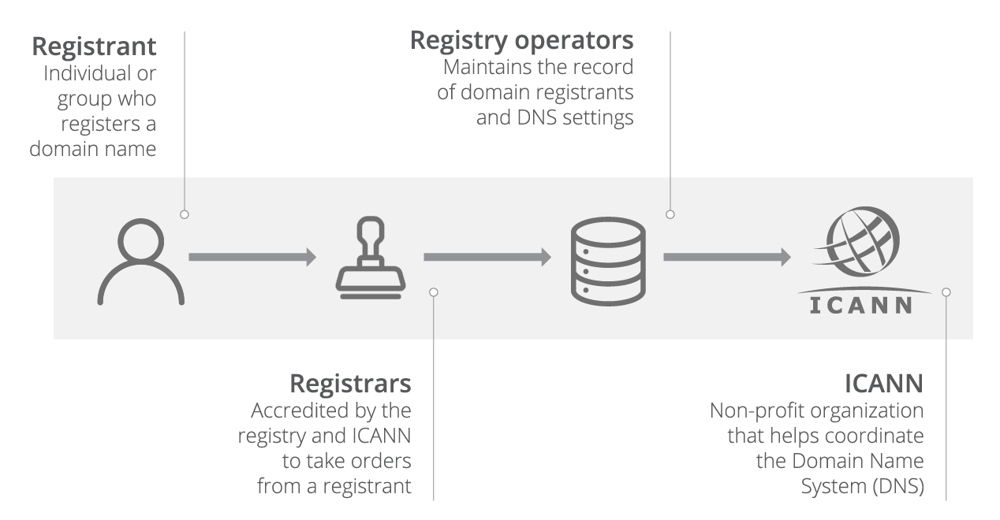

When you register a domain, you become the owner, or registrant, for that domain for a set period of time. Now that you are the registrant, you can create an authoritative record that tells the world the nameservers for your domain. The domain name system, or DNS, uses those nameservers to direct traffic to the IP address of your server.

When you put your site behind Cloudflare, you change your nameservers at your registry to ones we provide. Once we are responsible for your authoritative DNS, we can deliver the features that make your site faster and safer.

Your registry keeps the authoritative record for your nameservers. Each top-level domain (TLD) has a single registry that is responsible for maintaining those records. For example, .com is a TLD. Verisign is the exclusive registry for .com. As the TLD’s registry, Verisign stores the contact information and the nameservers for every .com domain in the world. As the registrant for a domain, you can tell your domain’s registry which nameservers DNS should use.

So where do registrars fit in this relationship? Domain registrars communicate your ownership, and subsequent changes, of a domain to the registry for that TLD. Registries trust registrars to only accept changes from the domain owner and to accurately convey that information so that the registry can update their record. While there is one registry for every TLD, hundreds of registrars are able to register a domain.